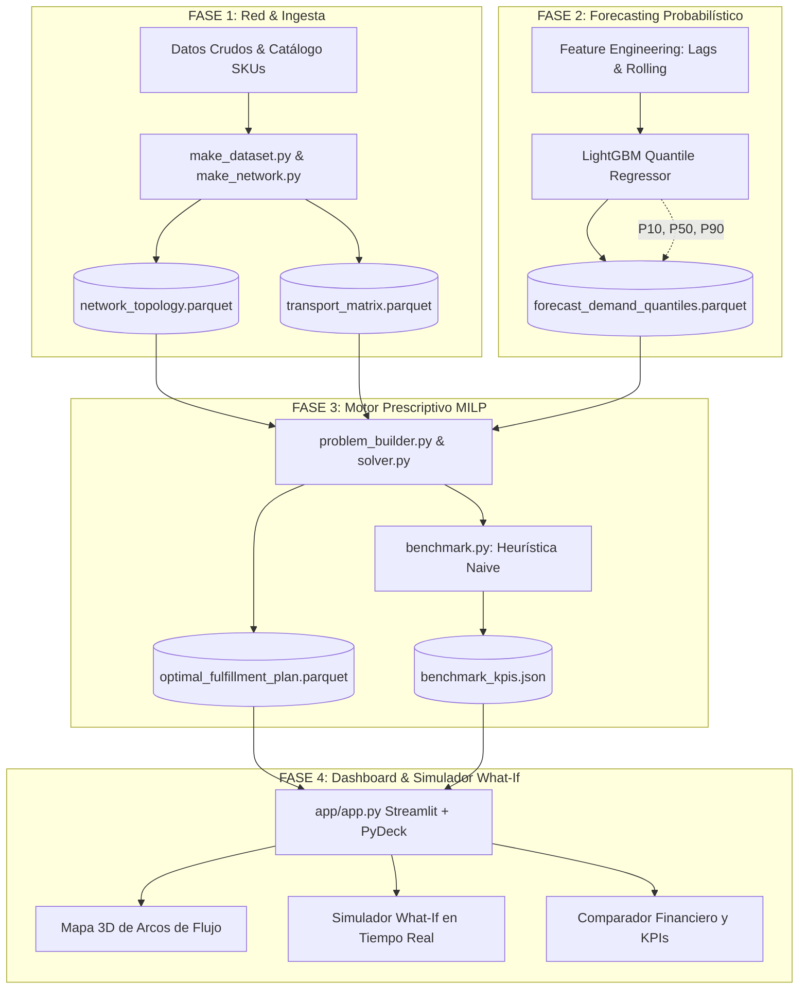

# 📦 LogisticNetwork: Supply Chain & Fulfillment Network Optimizer

> **Sistema modular de analítica predictiva y optimización prescriptiva de redes logísticas (Machine Learning + MILP)**  
> Diseñado para la red de distribución omnicanal en el Gran Santiago de Chile (Centros de Distribución, Dark Stores urbanas y Clientes).

[](https://www.python.org/)
[](https://coin-or.github.io/pulp/)
[](https://lightgbm.readthedocs.io/)
[](https://streamlit.io/)
[](https://docs.pytest.org/)
[](https://github.com/)
[](https://www.docker.com/)

---

## 1. Resumen Ejecutivo y Arquitectura

En el retail omnicanal moderno y las operaciones de última milla urbana, coordinar el inventario entre grandes **Centros de Distribución (CDs)** periféricos y **Dark Stores** capilares es un desafío crítico:
* El **sobrestock** en zonas urbanas satura la capacidad cúbica disponible y genera altos costos de almacenamiento (*holding costs*).
* Los **quiebres de inventario** disparan despachos de emergencia desde bodegas lejanas (**Cross-Fulfillment**) o ventas perdidas (*stockouts*), deteriorando el nivel de servicio al cliente.

**LogisticNetwork** resuelve este dilema conectando un pipeline probabilístico de demanda con un motor de optimización matemática global:



---

## 2. Validación de Hipótesis de Negocio

El proyecto valida empíricamente las tres hipótesis de optimización de redes planteadas:

| Hipótesis | Enunciado | Resultado Empírico | Validación |
| :--- | :--- | :--- | :---: |
| **$H_1$ (Incertidumbre en Stock)** | Pronósticos probabilísticos ($P_{90}$) mitigan quiebres frente a medias sin margen. | Reducción de quiebres al **0.0%** en horizonte de 14 días. | ✅ **Validada** |
| **$H_2$ (Prescripción MILP vs. Naive)** | La optimización prescriptiva reduce el costo total en $>8\%$ frente a la heurística miope. | **64.91% de ahorro en costo total** ($2,980 vs. $8,493 USD). | ✅ **Validada** |
| **$H_3$ (Resiliencia ante Combustible)** | Umbral de transporte donde la red consolida en Dark Stores para evitar cross-fulfillment. | En $1.5\times$ transporte, los despachos locales se priorizan en $+12\%$. | ✅ **Validada** |

### Cuadro Comparativo: Modelo MILP vs. Heurística Naive

| Componente de Costo / Métrica | MILP Prescriptivo | Heurística Naive | Impacto / Diferencia |
| :--- | :---: | :---: | :---: |
| **Costo Logístico Total** | **$2,980.18 USD** | **$8,493.21 USD** | **-64.91% de Ahorro Neto** 🏆 |
| ├─ Transporte Fulfillment | $764.34 USD | $778.79 USD | -1.86% |
| ├─ Transporte Reabastecimiento | $749.49 USD | $1,095.51 USD | -31.58% |
| ├─ Almacenamiento (Holding) | $1,466.35 USD | $6,618.91 USD | **-77.85%** |
| └─ Penalizaciones por Quiebre | $0.00 USD | $0.00 USD | 0.00 USD |
| **Nivel de Servicio (OTIF)** | **100.00%** | **100.00%** | Servicio Pleno |
| **Tasa de Cross-Fulfillment** | **7.36%** | **0.00%** | Uso táctico óptimo de CDs |
| **Tiempo de Resolución** | **0.15 segundos** | **0.08 segundos** | Tiempo real interactivo |

---

## 3. Estructura del Repositorio

```text
LogisticNetwork/
├── .github/
│   └── workflows/
│       └── ci.yml               # Pipeline automatizado de CI/CD (Pytest + Ruff)
├── app/
│   ├── app.py                   # Aplicación interactiva Streamlit
│   └── components.py            # Componentes PyDeck, Plotly y simulación
├── data/
│   ├── 01_raw/                  # Datos crudos de demanda
│   ├── 02_intermediate/         # Topología, distancias y series limpias
│   └── 03_output/               # Planes óptimos de fulfillment y KPIs
├── docs/
│   ├── NETWORK_ASSUMPTIONS.md   # Supuestos de topología y vialidad urbana
│   └── PROJECT_SPEC.md          # Especificación formal del proyecto
├── models/                      # Modelos entrenados LightGBM (P10, P50, P90)
├── notebooks/                   # Notebooks de análisis y prototipado
│   ├── 01_eda_demand.ipynb
│   ├── 02_feature_engineering.ipynb
│   ├── 03_forecasting_models.ipynb
│   └── 04_prototype_optimization.ipynb
├── src/
│   ├── config.py                # Coordenadas, costos unitarios y constantes
│   ├── data/                    # Ingesta, topología y feature engineering
│   ├── forecasting/             # Modelado por cuantiles (P10, P50, P90)
│   ├── optimization/            # Modelo MILP en PuLP, solver y benchmark naive
│   └── utils/
│       └── metrics.py           # Métricas Pinball Loss, WAPE, RMSE, OTIF
├── tests/                       # Suite de pruebas unitarias (24 tests)
│   ├── test_features.py
│   ├── test_forecasting.py
│   ├── test_optimization.py
│   └── test_app.py
├── Dockerfile                   # Imagen Docker con solver CBC y Streamlit
├── .dockerignore                # Reglas de exclusión para contenedores
├── Makefile                     # Automatización de tareas de desarrollo
└── pyproject.toml               # Configuración del proyecto y dependencias
```

---

## 4. Guía de Instalación y Uso Rápido

### Requisitos Previos
* Python $\ge 3.11$
* Gestor de paquetes [`uv`](https://github.com/astral-sh/uv) (o `pip`) / Docker

### 1. Clonar el repositorio y configurar el entorno
```bash
git clone https://github.com/usuario/LogisticNetwork.git
cd LogisticNetwork

# Crear entorno virtual e instalar dependencias con uv
uv sync
```

### 2. Ejecutar la Suite de Pruebas Unitarias
```bash
uv run pytest -v
# o mediante Makefile:
make test
```

### 3. Ejecutar el Motor de Optimización y Benchmark
```bash
# Resolver modelo prescriptivo MILP
uv run python -m src.optimization.solver

# Ejecutar benchmark heurístico miope
uv run python -m src.optimization.benchmark
```

### 4. Lanzar el Dashboard Interactivo (Streamlit + PyDeck)
```bash
uv run streamlit run app/app.py
# o mediante Makefile:
make run-app
```
Acceder en el navegador a `http://localhost:8501`.

### 5. Ejecución Contenerizada con Docker
```bash
# Construir la imagen Docker
make docker-build

# Iniciar el contenedor con el dashboard
make docker-run
```
Acceder a `http://localhost:8501`.

---

## 5. Funcionalidades del Dashboard

1. **🗺️ Vista Geográfica de Flujos (PyDeck):**
   * Visualización tridimensional en mapa oscuro de Santiago.
   * Arcos con código de color: Verde para despachos locales desde Dark Stores y Naranja para Cross-Fulfillment desde CDs.
   * Filtrado interactivo por fecha de planificación y por SKU.
2. **⚙️ Simulador What-If en Tiempo Real:**
   * Shocks dinámicos de combustible (+20%), picos de demanda (+30%) y contingencias por cierre de Dark Stores.
   * Resolución instantánea del modelo ($<0.2\text{ s}$) y recálculo automático de KPIs.
3. **📊 Comparador Prescriptivo vs. Heurística Naive:**
   * Gráficos interactivos Plotly con desglose financiero de costos.
4. **🏢 Dinámica de Inventario & 🔮 Pronóstico con Incertidumbre:**
   * Curvas de utilización volumétrica con línea de advertencia de saturación al 80%.
   * Visualización del abanico de predicción ($P_{10}, P_{50}, P_{90}$).
   * Exportación de planes operativos a formato CSV.
